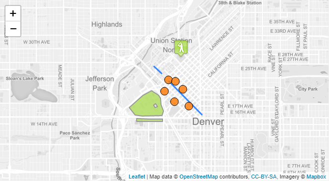

# Vue2Leaflet


<a href="https://travis-ci.org/KoRiGaN/Vue2Leaflet">
  
</a>
<a href="https://www.npmjs.com/package/vue2-leaflet">
  
</a>
<a href="https://www.npmjs.com/package/vue2-leaflet">
  
</a>
<a href="https://www.npmjs.com/package/vue2-leaflet">
  
</a>
<a href="https://gitter.im/Vue2Leaflet/Lobby?utm_source=badge&utm_medium=badge&utm_campaign=pr-badge&utm_content=badge">
  
</a>

[](https://coveralls.io/github/KoRiGaN/Vue2Leaflet?branch=master)

Vue2Leaflet is a JavaScript library for the [Vue](https://vuejs.org/) framework that wraps [Leaflet](http://leafletjs.com/) making it easy to create reactive maps.



## How to install

``` bash
npm install vue2-leaflet leaflet --save
```

For more detailed information you can follow the [Quick Start Guide](https://korigan.github.io/Vue2Leaflet/#/quickstart.md)

## Breaking change from 1.x.x to 2.x.x

A new major release 2.0,0 is available and come with one breaking change:

### Leaflet is not automatically installed anymore

Leaflet is now a peerDependency and need to be installed manually, we updated our docs to reflect this but please pay attention when migrating

### Importing the library in Webpack / Rollup

Now the code of vue2-leaflet is split component by component (while using a bundler like Webpack/Rollup/Parcel) to do so the following syntax is not working anymore:

```javascript
import Vue2Leaflet from 'vue2-leaflet' // INVALID
```

And has been replaced by

```javascript
import * as Vue2Leaflet from 'vue2-leaflet' // VALID
```

Is highly suggested to import only the needed modules by doing so:

```javascript
import {LMap, LTileLayer, LMarker} from 'vue2-leaflet'
```

This will reduce the size of the bundle significantly

## Documentation

[Go here](https://korigan.github.io/Vue2Leaflet/) to check out live examples and docs.

If you want to hack around, here is a [JS Fiddle](https://jsfiddle.net/Boumi/k04zpLx9/) to get started

## Leaflet Plugins

Leaflet plugins can easily work with Vue2Leaflet, if you want to use one I would recommand to look at the awesome work made by the community in the list below.

### Vue2Leafet plugins

* [vue-choropleth](https://github.com/voluntadpear/vue-choropleth) to display a choropleth map given a certain GeoJSON
* [vue2-leaflet-axesgrid](https://github.com/mudin/vue2-leaflet-axesgrid) wrapper for [AxesGrid](https://github.com/mudin/Leaflet.AxesGrid) to display axes and a grid
* [vue2-leaflet-editablecirclemarker](https://github.com/cualbondi/vue2-leaflet-editablecirclemarker) wrapper for [leaflet-editablecirclemarker](https://github.com/cualbondi/leaflet-editablecirclemarker)
* [vue2-leaflet-geosearch](https://github.com/fega/vue2-leaflet-geosearch) wrapper for [GeoSearch](https://github.com/smeijer/leaflet-geosearch) to perform geolocation and address lookup
* [vue2-leaflet-googlemutant](https://github.com/jperelli/vue2-leaflet-googlemutant) wrapper for [GoogleMutant](https://gitlab.com/IvanSanchez/Leaflet.GridLayer.GoogleMutant) to use Google Maps layers
* [vue2-leaflet-gpx](https://github.com/tdcook/vue2-leaflet-gpx) wrapper for [leaflet-gpx](https://github.com/mpetazzoni/leaflet-gpx) to display GPX tracks
* [vue2-leaflet-hotline](https://github.com/ikmolbo/vue2-leaflet-hotline) wrapper for [hotline](https://github.com/iosphere/Leaflet.hotline) to colour a line based on values along its length
* [vue2-leaflet-locatecontrol](https://github.com/vUdav/vue2-leaflet-locatecontrol) wrapper for [Leaflet.Locate](https://github.com/domoritz/leaflet-locatecontrol) to find the location of the user
* [vue2-leaflet-markercluster](https://github.com/jperelli/vue2-leaflet-markercluster) wrapper for [MarkerCluster](https://github.com/Leaflet/Leaflet.markercluster) to group nearby markers into single clusters
* [vue2-leaflet-movingmarker](https://github.com/LouisMazel/vue2-leaflet-movingmarker) wrapper for [Leaflet.Marker.SlideTo](https://gitlab.com/IvanSanchez/Leaflet.Marker.SlideTo) to animate the movement of markers
* [vue2-leaflet-path-transform](https://github.com/imudin/vue2-leaflet-path-transform) wrapper for [Leaflet.Path.Transform ](https://github.com/w8r/Leaflet.Path.Transform) to allow the user to drag, rotate, and resize vector features
* [vue2-leaflet-polygonfillpattern](https://github.com/guillaumejounel/vue2-leaflet-polygonfillpattern) wrapper for [leaflet-polygon-fillPattern](https://github.com/lwsu/leaflet-polygon-fillPattern) to fill polygons with image patterns
* [vue2-leaflet-polyline-measure](https://github.com/mikeu/vue2-leaflet-polyline-measure) wrapper for [Leaflet.PolylineMeasure](https://github.com/ppete2/Leaflet.PolylineMeasure) to allow the user to measure distances on the map
* [vue2-leaflet-polylinedecorator](https://github.com/jperelli/vue2-leaflet-polylinedecorator) wrapper for [PolylineDecorator](https://github.com/bbecquet/Leaflet.PolylineDecorator) to draw lines using patterns such as dashes, arrows, and icons
* [vue2-leaflet-rotatedmarker](https://github.com/imudin/vue2-leaflet-rotatedmarker) wrapper for [RotatedMarker](https://github.com/bbecquet/Leaflet.RotatedMarker) to rotate marker icons to dynamic headings
* [vue2-leaflet-tracksymbol](https://github.com/ais-one/vue2-leaflet-tracksymbol) wrapper for [TrackSymbol](https://github.com/lethexa/leaflet-tracksymbol) to show track symbols with speed, course, and heading
* [vue2-leaflet-vectorgrid](https://github.com/tesselo/vue2-leaflet-vectorgrid) wrapper for [VectorGrid](https://github.com/Leaflet/Leaflet.VectorGrid) to display gridded vector data

If you have created a plugin and want it to be listed here, let me know :-).

Vue2Leaflet is only a wrapper for Leaflet. I want to keep it as simple as possible so I don't want to add any plugin support into this repo.

## Run code locally for contributors

``` bash
# clone the repository
git clone https://github.com/KoRiGaN/Vue2Leaflet.git
cd Vue2Leaflet
# install dependencies and build vue2-leaflet
npm install
# create a symlink for vue2-leaflet
yarn link
cd examples
yarn install
# create a symbolic link for vue2-leaflet in node_modules/
yarn link vue2-leaflet
# serve with hot reload at localhost:8080
yarn run serve
```

Go to <http://localhost:8080/> to see running examples

NOTE: If you make changes to the library you should run 'npm run build' again in the root folder.
The dev server should detect modification and reload the examples

## Authors

Mickaël Bouchaud

Inspired by many map wrapper (google and leaflet) for many framework (React, Angular and Vue 1.0)

## Contributors

Thanks goes to these [wonderful people](https://github.com/KoRiGaN/Vue2Leaflet/contributors)

## License

This project is licensed under the MIT License - see the [LICENSE](LICENSE) file for details
