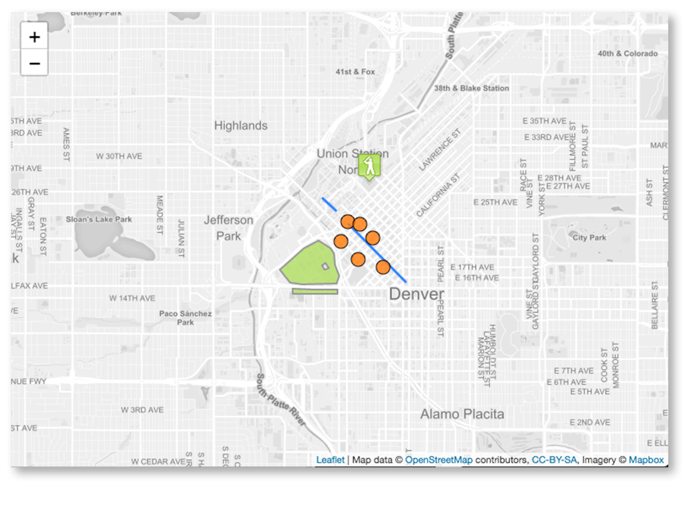

# Vue2Leaflet


<a href="https://travis-ci.org/KoRiGaN/Vue2Leaflet">
  
</a>
<a href="https://www.npmjs.com/package/vue2-leaflet">
  
</a>
<a href="https://www.npmjs.com/package/vue2-leaflet">
  
</a>
<a href="https://www.npmjs.com/package/vue2-leaflet">
  
</a>
<a href="https://gitter.im/Vue2Leaflet/Lobby?utm_source=badge&utm_medium=badge&utm_campaign=pr-badge&utm_content=badge">
  
</a>

Vue2Leaflet is a JavaScript library for the [Vue](https://vuejs.org/) framework that wraps [Leaflet](http://leafletjs.com/) making it easy to create reactive maps.




## Documentation
[Go here](https://korigan.github.io/Vue2Leaflet/) to check out live examples and docs.

If you want to hack around, here is a [JS Fiddle](https://jsfiddle.net/Boumi/k04zpLx9/) to get started
### :warning: Breaking changes from v0.x.x to v1.x.x :warning:
A new major release v1.x.x is available and come with some breaking changes.
#### :exclamation: Components names
As some component where conflicting with reserved name like Circle with SVG Circle, from v1.x.x all components are prefixed with L.

For example Marker component became LMarker (l-marker in template).
#### :exclamation: Events names
Event handling have been simplified and are now mapped directly to Leaflet event.

For example Marker move event was 'l-move' and became simply 'move'.
#### :sparkles: Leaflet Controls
v1.0.0 introduces Leaflet Controls you can now use them using LControlAttribution, LControlLayers, LControlScale and LControlZoom.

When adding LControlAttribution or LControlZoom to your template, remember to desactivate the default one by using LMap options:
``` javascript
{
  zoomControl: false,
  attributionControl: false
}
```
Otherwise you will end up with two zoom/attribution control.
## How to install
``` bash
$ npm install vue2-leaflet --save
```
For more detailed informations you can follow the [Quick Start Guide](https://korigan.github.io/Vue2Leaflet/)
## Leaflet Plugins
Leaflet plugins can easily work with Vue2Leaflet, if you want to use one I would recommand to look at the awesome work made by the community in the list below.

#### Vue2Leafet plugins:
* [vue2-leaflet-markercluster](https://github.com/jperelli/vue2-leaflet-markercluster) wrapper for [MarkerCluster](https://github.com/Leaflet/Leaflet.markercluster)
*  [vue2-leaflet-tracksymbol](https://github.com/ais-one/vue2-leaflet-tracksymbol) wrapper for [TrackSymbol](https://github.com/lethexa/leaflet-tracksymbol)
*  [vue-choropleth](https://github.com/voluntadpear/vue-choropleth) to display a choropleth map given a certain GeoJSON
*  [vue2-leaflet-geosearch](https://github.com/fega/vue2-leaflet-geosearch) wrapper for [GeoSearch](https://github.com/smeijer/leaflet-geosearch)
*  [vue2-leaflet-vectorgrid](https://github.com/tesselo/vue2-leaflet-vectorgrid) wrapper for [VectorGrid](https://github.com/Leaflet/Leaflet.VectorGrid) to display gridded vector data

If you have created a plugin and want it to be listed here, let me know :-).

Vue2Leaflet is only a wrapper for Leaflet. I want to keep it as simple as possible so I don't want to add any plugin support into this repo.

## FAQ
#### How can I access the Leaflet map object ?
First add a ref to the map
``` html
  <l-map ref="map" :zoom=13 :center="[47.413220, -1.219482]">
    ...
  </l-map>
```
Then in you JavaScript you can use mapObject which is Leaflet map instance :
``` javascript
this.$refs.map.mapObject;
```
This also work for any other component (Marker, Polyline, etc...)

#### How can I bind events of Vue2Leaflet components ?
All event binding can be done to event with the same name as in [leaflet documentation](http://leafletjs.com/reference-1.3.0.html).

For example if you want to listen to Vue2Leaflet.LMarker move event.
``` html
<l-marker :lat-lng="[47.413220, -1.219482]" @move="doSomething"></l-marker>
```
## Run code locally for contributors
``` bash
# clone the repository
$ git clone git@github.com:KoRiGaN/Vue2Leaflet.git
$ cd Vue2Leaflet
# install dependencies and build vue2-leaflet
$ npm install
$ npm run build
# create a symlink for vue2-leaflet
$ npm link
$ cd examples
$ npm install
# create a symbolic link for vue2-leaflet in node_modules/
$ npm link vue2-leaflet
# serve with hot reload at localhost:8080
$ npm run dev
```
Go to <http://localhost:8080/> to see running examples

NOTE: If you make changes to the library you should run 'npm run build' again in the root folder.
The dev server should detect modification and reload the examples
## Authors

Mickaël Bouchaud

Inspired by many map wrapper (google and leaflet) for many framework (React, Angular and Vue 1.0)

## Contributors

Thanks goes to these [wonderful people](https://github.com/KoRiGaN/Vue2Leaflet/contributors)

## License

This project is licensed under the MIT License - see the [LICENSE](LICENSE) file for details
